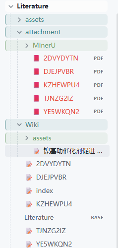
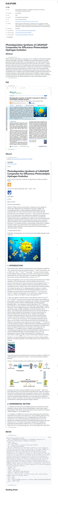
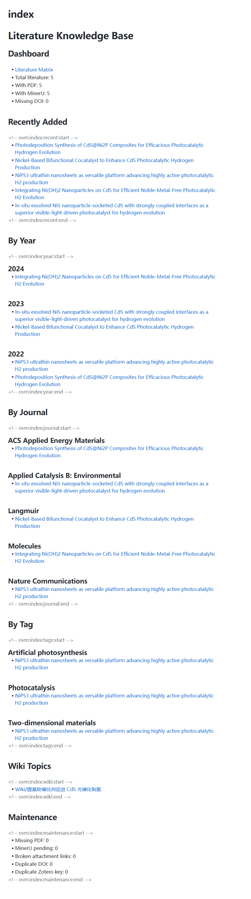
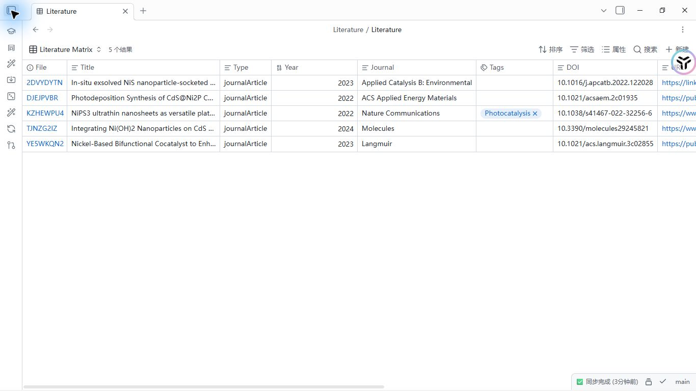
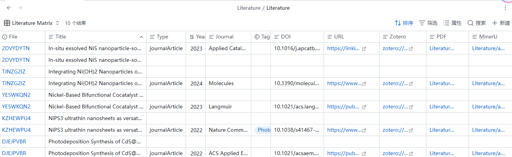
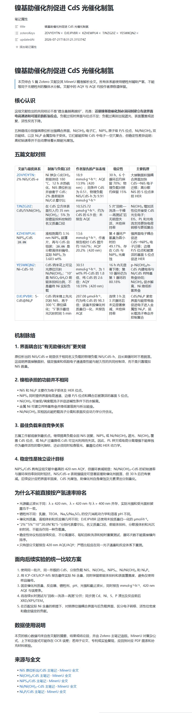

# Obsidian Vault MCP V2 完整使用教程

[English tutorial](./index.en.md) · [用户说明](../README.md) · [开发者文档](../DEVELOPMENT.md)

本教程从空白环境开始，完成软件安装、Zotero 本地 API、MinerU 精准解析、AI 客户端接入、自定义配置、首次文献导入、Wiki/Base 建立、迁移回滚与故障排查。

## 1. 先了解这条管道

V2 的默认流程是：

```text
Zotero 父条目 + PDF
        ↓ import / sync
Literature/{zoteroKey}.md + Vault 内 PDF 副本
        ↓ MinerU（可选）
全文 Markdown + 规范化图片
        ↓ 自动维护
index.md + Literature.base
        ↓ 连接的 AI 客户端
带 Zotero keys 和主笔记来源链接的 Wiki
```

`zoteroKey` 是永久身份。主笔记、PDF、MinerU Markdown 和图片的默认文件名都包含它，因此修改标题、作者或年份不会另建一套文件。

## 2. 软件与官方下载

### 2.1 必需软件

| 软件 | 用途 | 要求与官方下载 |
|---|---|---|
| Python | 安装 CLI/MCP server | Python 3.10+；CI 验证 3.10–3.13。[Python Downloads](https://www.python.org/downloads/) |
| Obsidian | 创建 Vault、阅读 Markdown、打开 Base | [Obsidian Download](https://obsidian.md/download) |
| Zotero Desktop | 提供本地元数据、notes、annotations 和 PDF | [Zotero Download](https://www.zotero.org/download/) |

只使用 PyPI 包时不需要 Git。需要源码安装或参与开发时再安装 [Git](https://git-scm.com/downloads)。

### 2.2 Obsidian 设置

1. 安装并打开 Obsidian。
2. 创建或打开目标 Vault；Vault 根目录应出现 `.obsidian`。
3. 打开 **设置 → 核心插件**，启用 **Bases**。

Bases 是 Obsidian 官方核心插件，不需要额外安装 Dataview。V2 生成标准 Markdown、Properties、Wikilink 和 `.base` 文件，即使 MCP server 没有运行，文件仍可直接阅读。[Obsidian Bases 官方说明](https://obsidian.md/help/bases)

### 2.3 可选软件

| 软件 | 何时需要 | 官方入口 |
|---|---|---|
| Zotero Connector | 从浏览器保存文献到 Zotero | [Zotero Connectors](https://www.zotero.org/download/connectors/) |
| Better BibTeX | 希望优先取得更完整的 BibTeX/citekey | [安装说明](https://retorque.re/zotero-better-bibtex/installation/) |
| MinerU Open API CLI | 需要把 PDF 精准或快速解析为 Markdown | [MinerU Ecosystem](https://github.com/opendatalab/MinerU-Ecosystem) |
| Node.js | 使用 npm 安装 OpenCode 等部分 AI 客户端 | [Node.js Download](https://nodejs.org/en/download) |
| AI 编程客户端 | 希望通过自然语言调用 26 个 MCP 工具 | 见[接入 AI 客户端](#8-接入-ai-客户端) |

## 3. 安装 Obsidian Vault MCP V2

项目有四个容易混淆的名字：

| 对象 | 名称 |
|---|---|
| PyPI distribution | `zotero-obsidian-mcp` |
| 安装后的 CLI | `obsidian-vault-mcp` |
| Python import | `obsidian_vault_mcp` |
| MCP server | `obsidian-literature` |

### 3.1 PyPI 安装

普通用户建议固定 V2 版本，避免未来跨主版本升级：

```powershell
python -m pip install --upgrade "zotero-obsidian-mcp==2.0.1"
```

也可以把 CLI 安装进隔离工具环境：

```powershell
pipx install "zotero-obsidian-mcp==2.0.1"
# 或
uv tool install "zotero-obsidian-mcp==2.0.1"
```

`pipx` 或 `uv` 需要先按各自官方说明安装。无论采用哪种方式，都应验证：

```powershell
python -c "from importlib.metadata import version; print(version('zotero-obsidian-mcp'))"
obsidian-vault-mcp --help
Get-Command obsidian-vault-mcp
```

### 3.2 虚拟环境安装

```powershell
py -m venv .venv
.\.venv\Scripts\Activate.ps1
python -m pip install --upgrade pip
python -m pip install "zotero-obsidian-mcp==2.0.1"
```

macOS/Linux 激活命令为：

```bash
python3 -m venv .venv
source .venv/bin/activate
python -m pip install --upgrade pip
python -m pip install "zotero-obsidian-mcp==2.0.1"
```

### 3.3 源码安装

```powershell
git clone https://github.com/luffysolution-svg/obsidian-vault-mcp.git
Set-Location obsidian-vault-mcp
git checkout v2.0.1
python -m pip install .
```

只有开发者才需要 editable 与测试依赖：

```powershell
python -m pip install -e ".[dev]"
```

## 4. 指定并初始化 Vault

### 4.1 显式路径最可靠

Windows PowerShell 当前会话：

```powershell
$env:OBSIDIAN_VAULT_PATH = "D:\Notes\MyVault"
```

macOS/Linux：

```bash
export OBSIDIAN_VAULT_PATH="/Users/me/Notes/MyVault"
```

也可以在每条 CLI 命令中使用 `--vault-path`，它的优先级最高：

```powershell
obsidian-vault-mcp doctor --vault-path "D:\Notes\MyVault"
```

`OBSIDIAN_VAULT_PATH=auto` **不会读取 Obsidian 当前打开的 Vault**。它只从 MCP 进程的当前工作目录开始，逐级向父目录寻找 `.obsidian`。只有 Agent 项目位于 Vault 内时才建议使用 `auto`。

### 4.2 初始化唯一配置

```powershell
obsidian-vault-mcp config init --dry-run
obsidian-vault-mcp config init
obsidian-vault-mcp config validate
obsidian-vault-mcp config get
```

配置写到：

```text
<Vault>/.obsidian-vault-mcp.json
```

如果文件已经存在，直接编辑并执行 `config validate`，不要把旧文件删除后重建。配置中的 `$schema` 指向仓库发布的 JSON Schema，可为支持 JSON Schema 的编辑器提供提示；运行时仍会执行更严格的跨字段与文件名校验。

### 4.3 理解 doctor

```powershell
obsidian-vault-mcp doctor
```

输出是一个 JSON 对象。重点检查：

- `config.ok`：配置是否成功加载；
- `zotero.ok`：Zotero 本地 API 是否可达；
- `mineru.available`：是否能找到 `mineru-open-api` 命令。

顶层 `ok` 当前只代表配置加载成功；它不等于 Zotero、MinerU token 或网络都已经可用。

## 5. 配置 Zotero 本地 API

V2 使用 Zotero Desktop 的本地 API，不需要 Zotero 云端 API key。

1. 打开 Zotero Desktop。
2. 进入 **设置 → 高级**。
3. 启用 **允许本机其他应用程序与 Zotero 通信**。
4. 保持 Zotero 运行。

默认地址：

```text
http://127.0.0.1:23119/api
```

测试连接、搜索与集合：

```powershell
obsidian-vault-mcp call zotero_ping --json '{}'
obsidian-vault-mcp call zotero_search_items --json '{"query":"CdS hydrogen evolution"}'
obsidian-vault-mcp call zotero_list_collections --json '{}'
```

浏览器直接打开本地 API 可能得到 `Request not allowed`；请用上述 CLI 进行测试。Zotero 的本地 API 说明见[官方 Web API v3 文档](https://www.zotero.org/support/dev/web_api/v3/basics#local_api)。

自定义端口时可覆盖：

```powershell
$env:ZOTERO_LOCAL_API = "http://127.0.0.1:23119/api"
```

如果 Zotero 数据目录不是默认位置，可把变量指向其 `storage` 子目录：

```powershell
$env:ZOTERO_STORAGE_DIR = "D:\ZoteroData\storage"
```

该绝对路径只用于找到源 PDF，并写入隐藏 state；不会写到用户可见笔记。

如果附件是 Zotero 的“链接到文件”，Zotero 本地 API 会返回 `attachments:` 相对路径。请把 Zotero **设置 → 高级 → 文件和文件夹 → 链接附件基础目录**配置为一个固定目录，并在 Vault 的 `.obsidian-vault-mcp.json` 中填写同一目录：

```json
{
  "zotero": {
    "linkedAttachmentBaseDir": "D:\\Reference PDFs"
  }
}
```

也可以在启动 CLI/MCP server 前使用环境变量；非空配置值优先于环境变量：

```powershell
$env:ZOTERO_LINKED_ATTACHMENT_BASE_DIR = "D:\Reference PDFs"
```

macOS/Linux：

```bash
export ZOTERO_LINKED_ATTACHMENT_BASE_DIR="/Users/me/Reference PDFs"
```

`ZOTERO_STORAGE_DIR` 只处理 Zotero 管理的 `storage:` 附件，`linkedAttachmentBaseDir`/`ZOTERO_LINKED_ATTACHMENT_BASE_DIR` 只处理 `attachments:` 链接附件。V2.0.1 会拒绝越出基础目录的 `..` 和盘符路径；缺少基础目录时，导入会返回明确错误，而不会猜测本机路径。

### 5.1 安装 Better BibTeX（可选）

1. 从 [Better BibTeX 最新安装页](https://retorque.re/zotero-better-bibtex/installation/) 下载 `.xpi`。
2. 在 Zotero 中打开 **工具 → 插件**。
3. 点击齿轮，选择 **Install Plugin From File…**，选择下载的 `.xpi`。
4. 重启 Zotero。

V2 的 `bibtex.provider: auto` 会优先尝试 Better BibTeX，再尝试 Zotero 原生导出，最后使用内置基础生成器。Better BibTeX 不是必需依赖；`zoteroKey` 才是存储身份，citekey 改变不会重命名默认文件。

## 6. 安装并认证 MinerU

不需要全文解析时可以跳过本节。V2 始终解析已经复制进 Vault 的 PDF，不直接修改 Zotero storage。

### 6.1 安装 Open API CLI

Windows PowerShell：

```powershell
irm https://cdn-mineru.openxlab.org.cn/open-api-cli/install.ps1 | iex
```

macOS/Linux：

```bash
curl -fsSL https://cdn-mineru.openxlab.org.cn/open-api-cli/install.sh | sh
```

验证命令：

```powershell
mineru-open-api version
```

### 6.2 精准解析认证

在 [MinerU Token 管理页](https://mineru.net/apiManage/token) 获取凭据，然后在自己的终端执行：

```powershell
mineru-open-api auth
mineru-open-api auth --verify
```

不要把 token 粘贴给 AI、写进文档或提交到 Git。`auth` 会把凭据保存在用户目录的 MinerU 配置中，V2 可自动检测。也支持进程环境变量 `MINERU_TOKEN` 或 `MINERU_API_TOKEN`，但本地认证文件通常更安全。

### 6.3 V2 模式映射

| `mineru.mode` | 实际行为 |
|---|---|
| `auto` | 检测到环境 token 或 MinerU 认证文件时使用 `extract`；否则使用 `flash-extract` |
| `api` | 强制使用需要 token 的精准 `extract` |
| `local` | 使用无 token 的 `flash-extract`；此名称不代表离线本地模型 |

需要保证精准解析时，在 Vault 配置中使用：

```json
{
  "schemaVersion": 2,
  "mineru": {
    "mode": "api"
  }
}
```

Windows 找不到可执行 shim 时可指定：

```powershell
$env:MINERU_CLI_COMMAND = "C:\Tools\mineru-open-api.cmd"
```

真实解析才会验证 token、上传与下载链路；`obsidian-vault-mcp mineru parse ... --dry-run` 只返回计划，不会启动 MinerU。代理/VPN 环境需保证 `mineru.net`、`cdn-mineru.openxlab.org.cn` 和相关 OpenXLab/OSS 域名可用。

## 7. 首次完整导入

### 7.1 找到父条目 key

```powershell
obsidian-vault-mcp call zotero_search_items --json '{"query":"photocatalysis"}'
```

选择返回结果中的 Zotero **父条目** key，例如 `ABCD1234`。不要使用 PDF 子附件 key 作为导入身份。

### 7.2 先预览，再正式导入

```powershell
obsidian-vault-mcp import item ABCD1234 --dry-run
obsidian-vault-mcp import item ABCD1234 --transaction-id import-ABCD1234-001
```

成功后应出现：

```text
Literature/ABCD1234.md
Literature/attachment/ABCD1234.pdf
Literature/index.md
Literature/Literature.base
.obsidian-vault-mcp/state/items/ABCD1234.json
```

同步已存在条目：

```powershell
obsidian-vault-mcp sync item ABCD1234
```

导入或同步整个集合：

```powershell
obsidian-vault-mcp import collection COLLKEY --dry-run
obsidian-vault-mcp import collection COLLKEY
obsidian-vault-mcp sync collection COLLKEY
```

### 7.3 MinerU 单篇与批量解析

```powershell
obsidian-vault-mcp mineru parse ABCD1234 --transaction-id mineru-ABCD1234-001
obsidian-vault-mcp mineru parse-batch ABCD1234 EFGH5678 IJKL9012
```

解析先写 `.obsidian-vault-mcp/staging/<transactionId>/`。只有 Markdown、图片和路径全部验证通过后，才会整体替换 `Literature/attachment/MinerU/` 下的正式文件。

### 7.4 建立 Wiki、Index 和 Base

先让 Agent 获取可追溯上下文：

```powershell
obsidian-vault-mcp wiki context "CdS 光催化制氢" --limit 20
```

Agent 综合内容后调用 `literature_wiki_write`；手工 CLI 也可以：

```powershell
$content = Get-Content -Raw -Encoding UTF8 .\wiki-body.md
obsidian-vault-mcp wiki write "CdS 光催化制氢" `
  --content $content `
  --zotero-key ABCD1234 `
  --zotero-key EFGH5678 `
  --transaction-id wiki-cds-001
```

Wiki 写入至少需要一个有效 `zoteroKey`，并自动补充主笔记来源链接。随后维护全局入口：

```powershell
obsidian-vault-mcp index rebuild
obsidian-vault-mcp base rebuild
obsidian-vault-mcp verify
```

导入和同步默认已经重建 Index/Base；显式重建适合 Wiki 更新、手工修改或关闭自动重建后的维护。`verify` 扫描整个 Vault 的可见 Markdown/Base，warning 也会令 `ok=false`，请按 `issues[].path` 判断是否属于 Literature。

## 8. 接入 AI 客户端

### 8.1 安装一个客户端（可选）

你只需要选择一个。安装命令可能随客户端更新，以下链接均指向官方或上游说明：

- **Codex**：[官方 Codex 文档](https://developers.openai.com/codex/)。Windows 可使用 `irm https://chatgpt.com/codex/install.ps1 | iex`；macOS/Linux 可使用 `curl -fsSL https://chatgpt.com/codex/install.sh | sh`。
- **Claude Code**：[官方 Quickstart](https://code.claude.com/docs/en/quickstart)。Windows 可使用 `irm https://claude.ai/install.ps1 | iex`。
- **OpenCode**：[官方文档](https://opencode.ai/en/docs)。可使用 `npm install -g opencode-ai`。
- **Pi**：[上游仓库](https://github.com/badlogic/pi-mono)。V2 为 Pi 安装薄 TypeScript Extension。
- **Hermes Agent**：[上游安装说明](https://github.com/NousResearch/hermes-agent/blob/main/website/docs/getting-started/installation.md)。
- **WorkBuddy**：[官方文档](https://docs.work-buddy.ai/)。安装后确保 `workbuddy` 命令在 `PATH`。

### 8.2 一键安装 MCP/Extension

安装器要求对应客户端命令已在 `PATH`。始终显式提供项目目录，并先 dry-run：

```powershell
obsidian-vault-mcp agent install codex --project-dir "D:\MyProject" --dry-run
obsidian-vault-mcp agent install codex --project-dir "D:\MyProject"
```

其他客户端：

```powershell
obsidian-vault-mcp agent install claude --project-dir "D:\MyProject" --dry-run
obsidian-vault-mcp agent install opencode --project-dir "D:\MyProject" --dry-run
obsidian-vault-mcp agent install hermes --project-dir "D:\MyProject" --dry-run
obsidian-vault-mcp agent install workbuddy --project-dir "D:\MyProject" --dry-run
obsidian-vault-mcp agent install pi --project-dir "D:\MyProject" --dry-run
```

| 客户端 | 项目级目标 |
|---|---|
| Codex | `.mcp.json` |
| Claude Code | `.mcp.json` |
| OpenCode | `opencode.json` |
| Hermes | `.hermes/config.yaml` |
| WorkBuddy | `.workbuddy/mcp.json` |
| Pi | `.pi/extensions/obsidian-vault-mcp.ts` |

正式安装会：检测客户端、读取并合并原配置、创建同目录备份、验证 JSON/YAML、启动一次 MCP handshake；失败则恢复原配置。Handshake 只验证 server 能启动，不代表 Vault、Zotero 或 MinerU 都就绪。

Codex/Claude/Hermes/WorkBuddy 模板中的 `OBSIDIAN_VAULT_PATH=auto` 会覆盖进程继承的同名环境变量。项目不在 Vault 内时，应在本机配置中把它改成显式路径，或删除该 `env` 项让客户端继承安全设置；含绝对路径的项目配置不要提交。

### 8.3 手工 MCP 配置

原生 MCP 客户端最终都启动同一个本地进程：

```json
{
  "mcpServers": {
    "obsidian-literature": {
      "type": "stdio",
      "command": "obsidian-vault-mcp",
      "args": ["serve", "--transport", "stdio"],
      "env": {
        "OBSIDIAN_VAULT_PATH": "D:\\Notes\\MyVault"
      }
    }
  }
}
```

不同客户端的外层字段可能不同，安装器会生成正确格式。默认并推荐 `stdio`；SSE/streamable HTTP 没有内建认证，不要直接暴露到公共网络。

### 8.4 可直接交给 AI 的安装提示词

```text
请安装并配置 Obsidian Vault MCP V2。任何写操作都先 dry-run。

1. 检查 Python 版本至少为 3.10，并安装 zotero-obsidian-mcp==2.0.1；
   用 importlib.metadata 验证实际安装版本，不要把旧版 1.x 当成 V2。
2. 询问我的 Obsidian Vault 路径，确认其中存在 .obsidian；不要依赖 auto，
   不要把绝对路径提交到 Git。
3. 依次运行 config init --dry-run、config init、config validate 和 doctor。
4. 如果使用 Zotero，提醒我启动 Desktop 并启用本地 API，再调用 zotero_ping；
   不要索取 Zotero 云端 API key。
5. 如果需要 MinerU 精准解析，让我在自己的终端运行 mineru-open-api auth；
   不要要求我在聊天中粘贴 token。
6. 对当前 AI 客户端执行 agent install <client> --project-dir <project> --dry-run，
   展示目标与合并结果，确认后再正式安装。
7. 安装后分别检查 doctor 的 config、zotero、mineru 子状态。
8. 不删除现有配置、不覆盖用户笔记、不公开 Vault 内容；保存 transactionId，
   最后运行 literature_verify。
```

## 9. 用户自定义配置

配置可以只写要覆盖的字段，其他值继承默认值。下面是已接线并经过验证的安全示例：

```json
{
  "$schema": "https://raw.githubusercontent.com/luffysolution-svg/obsidian-vault-mcp/main/obsidian-vault-mcp.schema.json",
  "schemaVersion": 2,
  "literature": {
    "root": "Research/Literature",
    "index": "Research/Literature/index.md",
    "base": "Research/Literature/Literature.base",
    "wikiFolder": "Research/Literature/Wiki"
  },
  "naming": {
    "note": "{zoteroKey}-{year}-{shortTitle}.md",
    "pdf": "{zoteroKey}-{shortTitle}.pdf",
    "mineruMarkdown": "{zoteroKey}.md",
    "mineruImage": "{zoteroKey}-fig{index:03d}.{ext}"
  },
  "attachments": {
    "pdfFolder": "Research/Literature/attachment",
    "copyPdf": true,
    "overwritePolicy": "if-source-changed"
  },
  "note": {
    "omitEmptySections": true,
    "readingNotesHeading": "阅读笔记",
    "embedPdf": true,
    "embedMineruMarkdown": true
  },
  "zotero": {
    "apiBase": "http://127.0.0.1:23119/api",
    "linkedAttachmentBaseDir": "D:\\Reference PDFs",
    "syncTags": true,
    "paginationSize": 100
  },
  "bibtex": {
    "enabled": true,
    "provider": "auto"
  },
  "mineru": {
    "mode": "api",
    "markdownFolder": "Research/Literature/attachment/MinerU",
    "imageFolder": "Research/Literature/attachment/MinerU/image",
    "maxConcurrentJobs": 2
  },
  "index": {
    "autoRebuild": true,
    "recentLimit": 20
  },
  "base": {
    "autoRebuild": true,
    "name": "Literature Matrix"
  }
}
```

关键约束：

- `schemaVersion` 必须严格为 `2`。
- Vault 内容路径必须是 Vault 相对路径，拒绝盘符、UNC、`..` 和非法组件；唯一例外是 `zotero.linkedAttachmentBaseDir`，它是本机绝对源目录且只进入本地配置与隐藏 state。
- 主笔记、PDF、MinerU Markdown 的 pattern 必须包含 `{zoteroKey}`。
- 图片 pattern 必须包含 `{zoteroKey}`、`{index}` 和 `{ext}`。
- `identity.strategy` 固定为 `zoteroKey`。
- `frontmatter.fieldOrder` 是固定数据契约，不是自由排序选项。
- `mineru.imageLinkStyle` 当前固定为 `markdown-relative`。

以下字段保留在 schema 中，但 V2.0 的行为目前是固定的；请保持默认值，不把它们当成功能开关：`note.preserveUserSections`、`zotero.syncNotes`、`zotero.syncAnnotations`、`mineru.enabled`、`mineru.replacePreviousOutput`、`index.groupBy` 和全部 `safety.*`。例如安全事务始终启用，`safety.retainBackups` 暂不执行自动清理。

编辑后运行：

```powershell
obsidian-vault-mcp config validate
obsidian-vault-mcp config get
```

## 10. 效果展示

以下保留用户授权的五张真实验收截图，并新增一张修复后的 Base 截图用于展示 5 篇文献对应 5 行的最终结果。长图默认折叠。

### 10.1 Vault 目录分层



截图中的个别 `assets` 子目录属于演示 Vault，不是 V2 默认必建目录。

### 10.2 单篇主笔记、PDF、MinerU 与 BibTeX

<details>
<summary>展开单篇文献完整效果图</summary>



</details>

### 10.3 自动增长的 Index

<details>
<summary>展开 Index 仪表盘效果图</summary>



</details>

### 10.4 Obsidian Base 文献矩阵



修复后的 Base 仅纳入 `Literature` 顶层主笔记，5 篇文献对应 5 行；MinerU Markdown 不再被重复收录。

<details>
<summary>查看原始验收截图与重复行修复说明</summary>



原始截图中 5 篇文献与 5 份 MinerU Markdown 一度显示为 10 行。2.0.0 已把 Base 限定为顶层主笔记；升级后运行 `obsidian-vault-mcp base rebuild` 即可重建正确矩阵。

</details>

### 10.5 五篇文献形成的主题 Wiki

<details>
<summary>展开 Wiki 综合效果图</summary>



</details>

## 11. 事务、预览与回滚

正式写命令的 JSON 结果会返回 `transactionId`，应保存它：

```powershell
obsidian-vault-mcp preview import-ABCD1234-001
obsidian-vault-mcp rollback import-ABCD1234-001 --dry-run
obsidian-vault-mcp rollback import-ABCD1234-001
```

注意：

- dry-run 不落盘，之后不能通过 `preview` 查询该预览。
- 多个相关事务应按时间倒序回滚。
- 如果事务之后文件被用户修改，rollback 会报告冲突并拒绝覆盖。
- 只有明确接受覆盖时才使用：

```powershell
obsidian-vault-mcp rollback <transaction-id> --conflict-policy overwrite-managed
```

`preserve-user`、`fail`、`rename` 在回滚冲突中都不会强制覆盖。

## 12. 从 V1 迁移

先备份 Vault，再执行：

```powershell
obsidian-vault-mcp migrate v1-to-v2 --dry-run
```

预览会按旧 frontmatter 的 `zoteroKey` 聚合、检测重复、规划笔记/PDF/MinerU/图片移动、重写链接、生成 state 并重建 Index/Base。确认结果后：

```powershell
obsidian-vault-mcp migrate v1-to-v2 --apply
obsidian-vault-mcp verify
```

迁移结果中的 `transactionId` 可用于 `preview` 与 `rollback`。

## 13. 常见问题

| 现象 | 检查与处理 |
|---|---|
| 显示旧版 CLI 或只有 17 个工具 | 用 `importlib.metadata` 检查版本；安装 `zotero-obsidian-mcp==2.0.1` |
| 找不到 `obsidian-vault-mcp` | 用 `Get-Command`/`which` 检查 PATH；重新打开终端，或激活正确虚拟环境 |
| `auto` 找不到 Vault | 设置显式 `OBSIDIAN_VAULT_PATH`，或从 Vault 内启动 Agent |
| `config init` 提示已存在 | 保留原文件，编辑后运行 `config validate` |
| Zotero 返回 403 | 启用“允许本机其他应用程序与 Zotero 通信” |
| Zotero 连接被拒绝 | 确认 Desktop 正在运行、端口为 23119，代理不要接管 localhost |
| 元数据成功但 PDF 未复制 | 检查条目是否有已下载的 PDF 子附件。`storage:` 路径检查 `ZOTERO_STORAGE_DIR`；`attachments:` 路径设置 `zotero.linkedAttachmentBaseDir` 或 `ZOTERO_LINKED_ATTACHMENT_BASE_DIR` |
| 链接附件提示越出基础目录 | 确认 Zotero 与本项目配置使用同一基础目录；附件必须是该目录内的相对路径，不能包含 `..` 或盘符前缀 |
| Better BibTeX 不可用 | 它是可选项；检查返回的 provider/errors，V2 会继续尝试其他提供者 |
| MinerU 401 | 重新运行 `mineru-open-api auth`；不要把 token 放进命令历史或聊天 |
| doctor 显示 MinerU available 但解析失败 | `available` 只表示命令存在；执行一次真实 parse 检查 token/网络 |
| MinerU 在 Windows 无法启动 | 设置 `MINERU_CLI_COMMAND` 指向 `.cmd`/`.exe`；V2 会优先解析 Windows shim |
| `verify` 报告 Literature 外文件 | 它会扫描整个 Vault；根据 `issues[].path` 判断是否为已有普通笔记 |
| warning 但 `verify.ok=false` | 当前任何 issue（含 warning）都会令结果为 false |
| Base 仍有重复行 | 升级到 2.0.0 后运行 `obsidian-vault-mcp base rebuild` |
| rollback conflict | 按时间倒序回滚并先 dry-run；仅在接受覆盖时使用 `overwrite-managed` |

## 14. 更新与卸载

更新同一主版本：

```powershell
python -m pip install --upgrade "zotero-obsidian-mcp>=2.0,<3"
```

卸载 Python 包：

```powershell
python -m pip uninstall zotero-obsidian-mcp
```

Agent 安装器会在结果中的 `uninstall_instructions` 给出精确移除位置。卸载包不会删除 Vault 中的文献、PDF、Wiki 或备份；确认不再需要后再自行处理这些数据。

## 15. 隐私与安全检查清单

- 不提交 `.obsidian-vault-mcp.json`、`.obsidian-vault-mcp/`、token 或本机专用 Agent 配置。
- MinerU 精准解析会向外部服务上传 PDF；先确认文献授权和组织政策。
- Wiki context 会把摘要、Zotero notes、MinerU 摘录和已有 Wiki 正文交给当前 Agent。
- `doctor` 会返回绝对 Vault 路径；事务 diff 可能包含隐藏 state 的源 PDF 路径。
- Zotero 默认只通过 loopback 访问；自定义 `ZOTERO_LOCAL_API` 时应审查目标地址。
- 只使用受信任的 AI 客户端，默认坚持本地 `stdio`。
- 发布错误报告前先删除用户名、绝对路径、私人文献内容和 token。

仍有问题可到 [GitHub Issues](https://github.com/luffysolution-svg/obsidian-vault-mcp/issues) 提交最小复现、版本号和已脱敏的 JSON 错误结果。
